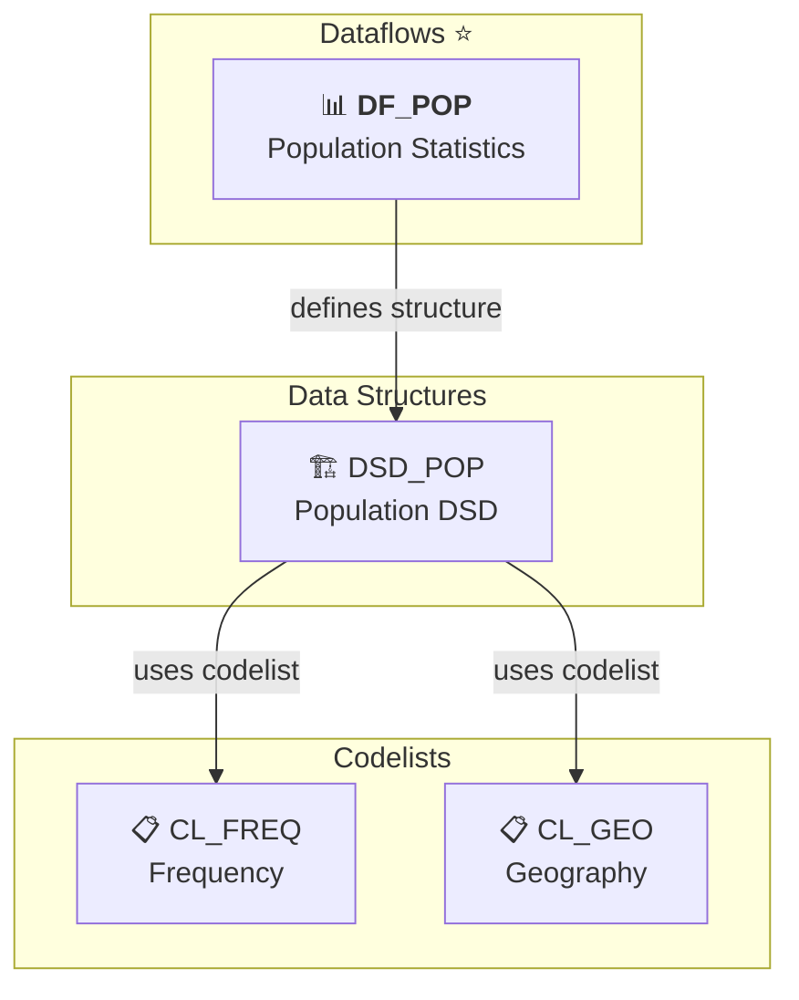
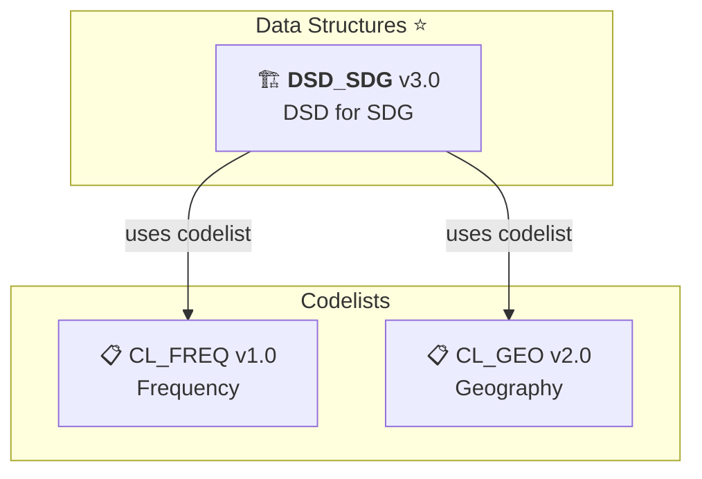
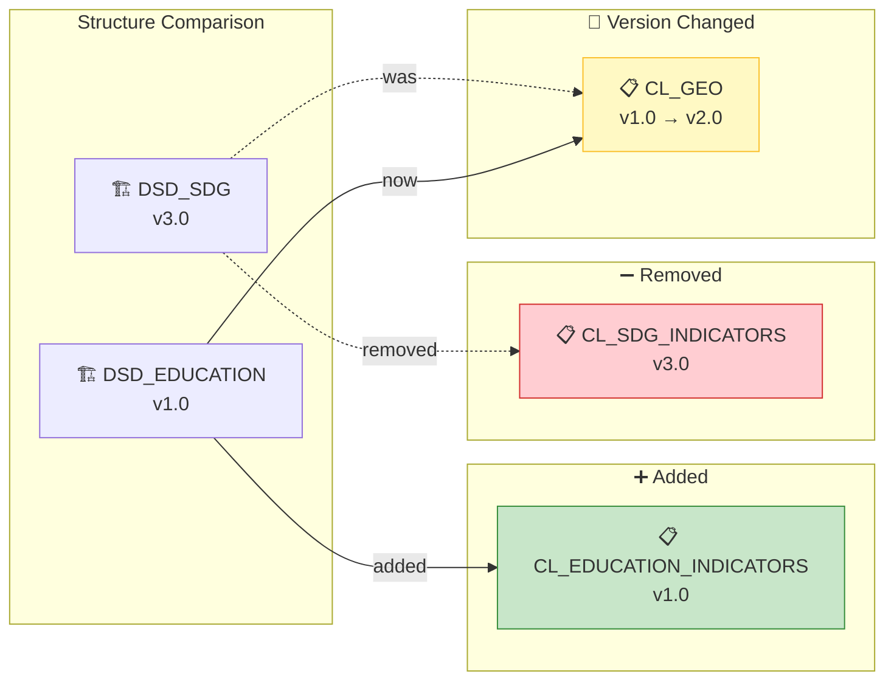

# SDMX MCP Gateway

A Model Context Protocol (MCP) server that provides progressive discovery tools for SDMX statistical artefacts and data. This implementation enables AI agents to explore and access SDMX-compliant statistical data repositories through interactive tools, resources, and prompts.

**Version 0.2.0** - Now with structured outputs, Streamable HTTP transport, and elicitation support.

## 🚀 Key Features

- **Progressive Discovery**: Reduces metadata transfer from 100KB+ to ~2.5KB
- **Structured Outputs**: All tools return validated Pydantic models
- **Multiple Transports**: STDIO (development) and Streamable HTTP (production)
- **Interactive Elicitation**: User confirmation dialogs for endpoint switching
- **Multi-Provider Support**: SPC, FBOS, SBS, ECB, UNICEF, IMF, OECD, ESTAT, ILO, ABS, BIS

## Quick Start

A public instance of this server is hosted on Railway. Point any MCP client at the URL below and you can skip cloning, installing dependencies, and managing a Python environment.

```
https://sdmx-mcp-gateway-production.up.railway.app/mcp
```

Transport is Streamable HTTP. The endpoint is shared and stateless from the client's perspective; each MCP session gets its own server-side state (endpoint selection, client pool, mismatch-hint cache).

Quick check that it responds:

```bash
curl -X POST https://sdmx-mcp-gateway-production.up.railway.app/mcp \
  -H "Content-Type: application/json" \
  -H "Accept: application/json, text/event-stream" \
  -d '{"jsonrpc":"2.0","id":1,"method":"initialize","params":{"protocolVersion":"2024-11-05","capabilities":{},"clientInfo":{"name":"probe","version":"0"}}}'
```

See [MCP Client Configuration](#mcp-client-configuration) for ready-to-paste configs for Claude Code, Claude Desktop, Codex, Cursor, Zed, and OpenCode.

### Health Status

A standalone monitor checks the hosted gateway and every provider endpoint
(through the gateway and directly) every two hours. See `monitor/README.md`
for running or deploying it. Once deployed, its status page shows current
health, per-endpoint history, and whether a failure sits in the gateway or
the upstream provider.

### Self-Hosting

If you prefer to run the server yourself (offline use, private deployments, development on the tools themselves), see [Installation](#installation) and [Running the Server](#running-the-server).

```bash
cd sdmx-mcp-gateway
uv sync
uv run python main_server.py                                     # STDIO, for local clients
uv run python main_server.py --transport http --port 8000        # HTTP, for remote clients
uv run mcp dev ./main_server.py                                  # MCP Inspector (browser UI)
```

## The Problem We Solve

Traditional SDMX queries with `references=all` return 100KB+ of XML metadata, overwhelming LLM context windows. Our progressive discovery approach provides a layered exploration:

| Step      | Operation                        | Data Size  |
| --------- | -------------------------------- | ---------- |
| 1         | Find dataflows by keyword        | ~300 bytes |
| 2         | Get dimension structure          | ~1KB       |
| 3         | Explore specific dimension codes | ~500 bytes |
| 4         | Check data availability          | ~700 bytes |
| 5         | Build final query URL            | ~200 bytes |
| **Total** |                                  | **~2.5KB** |

## Architecture

```
sdmx-mcp-gateway/
├── main_server.py              # FastMCP server with CLI
├── app_context.py              # Lifespan management & shared resources
├── config.py                   # Endpoint configuration
├── sdmx_progressive_client.py  # SDMX 2.1 REST client
├── utils.py                    # Validation & utilities
├── models/
│   ├── __init__.py
│   └── schemas.py              # Pydantic output schemas
├── tools/
│   ├── sdmx_tools.py           # Discovery tools implementation
│   └── endpoint_tools.py       # Endpoint management
├── resources/
│   └── sdmx_resources.py       # MCP resources
├── prompts/
│   └── sdmx_prompts.py         # Guided prompts
└── tests/                      # Test suite
```

## Available Tools

### Discovery Tools

| Tool                     | Description                               | Output Schema               |
| ------------------------ | ----------------------------------------- | --------------------------- |
| `list_dataflows`         | Find dataflows by keyword                 | `DataflowListResult`        |
| `get_dataflow_structure` | Get dimensions and structure              | `DataflowStructureResult`   |
| `get_dimension_codes`    | Explore codes for a dimension             | `DimensionCodesResult`      |
| `get_data_availability`  | Check what data exists                    | `DataAvailabilityResult`    |
| `get_structure_diagram`  | Generate Mermaid diagram of relationships | `StructureDiagramResult`    |
| `compare_structures`     | Compare two structures for differences    | `StructureComparisonResult` |
| `validate_query`         | Validate query parameters                 | `ValidationResult`          |
| `build_key`              | Construct SDMX key                        | `KeyBuildResult`            |
| `build_data_url`         | Generate data retrieval URL               | `DataUrlResult`             |
| `get_codelist`           | Browse specific codelist                  | `dict`                      |

### Reference Metadata

| Tool                      | Description                                          | Output Schema             |
| -------------------------- | ----------------------------------------------------- | -------------------------- |
| `get_reference_metadata`  | Summarise source, methodology, licence and caveats for a dataflow | `ReferenceMetadataResult` |
| `get_metadata_attribute`  | Get every value of one metadata attribute, with the slice each applies to | `MetadataAttributeValuesResult` |

Reference metadata is the descriptive material about a dataflow rather than its structure: who compiled it, from what source, under what licence, with what caveats. Coverage varies by provider, so the result's `channels` field reports which channel was available: `.Stat Suite` deployments (SPC, FBOS, SBS, OECD) publish it through a v2 MSD query, some other providers carry equivalent detail only in ordinary DSD attributes on the data message, and some publish neither. A channel status of `inconclusive` means the query did not produce a usable answer; that is different from a confirmed absence, which is what `empty` reports.

Pass `key` to narrow the query to one series. This matters for large dataflows: SPC's `DF_SDG` metadata query is 5.37 MB unfiltered against 5.6 KB with a partial key, and the tool refuses an unfiltered query over 2 MB (`too_broad`) by aborting the read partway through rather than downloading it in full; the same cap applies to both the MSD query and the DSD-attribute fallback used by providers without a `/v2/` endpoint.

#### `get_reference_metadata`: the summary

`get_reference_metadata` returns one entry per attribute the provider declares, in `metadata_attributes`, plus a `coverage` count and a per-channel `channels` status. Each attribute carries:

- `status`: `populated` when the provider published at least one value, `declared_empty` when every occurrence in the response read was blank -- for the whole dataflow when no key was supplied, or for the slice queried when one was, since a keyed request only reads that slice. A declared-but-empty attribute is a real, observed answer, not a missing one, and it is listed rather than omitted, so a blank licence field reads differently from a provider that has no licence concept at all.
- `value` and `drill_down`: `value` carries the headline text only when exactly one distinct value exists and it describes the whole dataflow. When the attribute's values differ by series, country or other slice, `value` is `null` and `drill_down` is `true`, meaning no single value can stand in as the dataflow's answer. This also fires when a provider happens to publish the identical text on every per-slice row without ever publishing an unqualified dataflow-wide row: the rule cannot tell "the same value repeated everywhere" apart from "one slice's value," so it withholds the headline in both cases and points to `get_metadata_attribute` instead.
- `distinct_values` and `scope`: how many distinct values were found, and whether the headline (when present) attaches to the whole dataflow (`dataflow`/`dataset`) or to one slice (`partial_key`).

`coverage` (`declared` / `populated` / `empty`) is reported only when a channel that can see the provider's full declared set actually answered: the MSD channel itself answered `found`, or it answered `empty` and the DSD-attribute fallback also resolved to `found` or `empty`. An MSD `empty` on its own is not enough, since the DSD fallback that runs alongside it may still be sitting on attributes the MSD channel never saw. `coverage` is `None` when nothing confirmed a declared set that way, or when the only channel that answered was the DSD-attribute fallback on its own, which shows populated attributes only and cannot see what a provider declares but leaves blank.

#### `get_metadata_attribute`: the drill-down

Call `get_metadata_attribute(dataflow_id, attribute_id, key=None, agency_id=None)` after `get_reference_metadata` reports `drill_down: true` for an attribute, to read every distinct value with the dimension key (`key_context`) it applies to. `attribute_id` is the short `id` from the summary, not the full dotted `path`. The result (`MetadataAttributeValuesResult`) has no separate error field; every case below is a normally-shaped result distinguished by `total` and by the text of `notes`. Four answers matter and are kept distinct:

- **Populated**: every distinct value, each with its `key_context`, `total` (the true count) and `truncated` (`true` once more than 200 distinct values exist, in which case `values` holds only the first 200).
- **Declared but empty**: `total: 0`, `values: []`, and a note stating the attribute is declared and left blank -- for the whole dataflow when no key was supplied, for the slice queried when one was. The first note does not start with `"Error:"`.
- **Unknown attribute id**: `total: 0`, `values: []`, and a first note starting with `"Error: "`, in one of two wordings depending on what the resolving channel found. When it found other attributes, the note reads `"Error: Unknown attribute '<id>' for <dataflow>: declared attributes are <ids>"`, naming the dataflow's declared attribute ids so a typo reads as "here is what exists" rather than as an empty result. When the declared set is confirmed empty instead (the MSD channel itself answered `found` or `empty`, and nothing turned up there or through the DSD fallback), the note reads `"Error: Unknown attribute '<id>' for <dataflow>: this dataflow's declared metadata attributes are confirmed empty."` A caller distinguishes either wording from the declared-but-empty case above by checking whether the first note starts with `"Error:"`, not by looking for a field that does not exist on this result.
- **No channel confirmed a declared set**: `total: 0`, `values: []`, and notes explaining which channel could not answer and why that is not evidence the attribute is missing. This uses the same rule `coverage` above does: the declared set is known only when the MSD channel itself answered `found`, or answered `empty` with the DSD-attribute fallback also resolving to `found` or `empty`. Every other combination lands here, including an MSD channel that answered `too_broad`, `inconclusive` or `unsupported` (whether or not the DSD fallback separately resolved to `empty`, since that fallback cannot confirm a declared set on its own) and an MSD `empty` paired with a DSD fallback that itself did not resolve. Like the declared-but-empty case, the notes here do not start with `"Error:"`.

Each value's `key_context` is `null` in two different situations that a caller must not conflate: from the MSD channel, `null` means the value is genuinely dataflow-wide; from the DSD-attribute fallback channel (used by providers without a `/v2/` endpoint), `null` means that channel has no per-value key to report at all, even when the value actually attaches to one series or observation rather than to the whole dataflow. A note on the result says which channel supplied the attribute when this applies.

### Endpoint Management

| Tool                          | Description                            | Output Schema          |
| ----------------------------- | -------------------------------------- | ---------------------- |
| `get_current_endpoint`        | Show the session's default provider    | `EndpointInfo`         |
| `list_available_endpoints`    | List all configured providers          | `EndpointListResult`   |

The session default is set once at startup from the `SDMX_ENDPOINT` env var and is not mutable at runtime. To target a specific provider for an individual call, pass `endpoint=<KEY>` to any endpoint-scoped tool.

### Resources

- `sdmx://agencies` - List of known SDMX data providers
- `sdmx://agency/{id}/info` - Specific agency details
- `sdmx://formats/guide` - Data format comparison
- `sdmx://syntax/guide` - Query syntax reference

### Prompts

- `discovery_guide` - Step-by-step data discovery workflow
- `troubleshooting_guide` - Common issue resolution
- `best_practices` - Use-case specific guidance
- `query_builder` - Interactive query construction

## Supported Data Sources

| Key      | Provider                         | Description                           | Constraints        |
| -------- | -------------------------------- | ------------------------------------- | ------------------ |
| `SPC`    | Pacific Data Hub                 | Pacific regional statistics (default) | Actual (single + bulk) |
| `FBOS`   | Fiji Bureau of Statistics        | Fiji official national statistics     | Actual (single + bulk) |
| `SBS`    | Samoa Bureau of Statistics       | Samoa official national statistics    | Actual (single + bulk) |
| `ECB`    | European Central Bank            | European financial statistics         | Allowed (single + bulk) |
| `UNICEF` | UNICEF                           | Children and youth statistics         | Actual (single + bulk) |
| `IMF`    | International Monetary Fund      | Global financial statistics           | Actual (single) |
| `OECD`   | OECD                             | Economic and social statistics        | Actual (single) |
| `BIS`    | Bank for International Settlements | International financial statistics  | Actual (single) |
| `ABS`    | Australian Bureau of Statistics  | Australian official statistics        | Actual (single) |
| `ILO`    | International Labour Organization | Labour and employment statistics     | Actual (single) |
| `ESTAT`  | Eurostat                         | European Union official statistics    | None |

Target a provider per call:

```python
# Pass endpoint= on any endpoint-scoped tool
list_dataflows(endpoint="ECB", limit=10)
get_dataflow_structure(dataflow_id="DF_CPI", endpoint="FBOS")

# Or rely on the session default (set at startup from SDMX_ENDPOINT env var)
list_dataflows(limit=10)
```

See `docs/ENDPOINT_CONFIGURATION.md` for provider-specific behaviours and constraint strategies.

## Installation

### Prerequisites

- Python 3.12 or higher
- [uv](https://docs.astral.sh/uv/) (recommended) or pip

### Using UV (Recommended)

```bash
cd sdmx-mcp-gateway
uv sync
```

### Using pip

```bash
cd sdmx-mcp-gateway
pip install -r requirements.txt
```

### Dependencies

- `mcp[cli]>=1.26.0` - Model Context Protocol SDK
- `pydantic>=2.0.0` - Structured output validation
- `httpx>=0.27.0` - Async HTTP client
- `certifi>=2024.0.0` - SSL certificates

## Running the Server

### CLI Options

```bash
uv run python main_server.py [OPTIONS]

Options:
  --transport, -t    Transport type: stdio, http, streamable-http (default: stdio)
  --host             Host for HTTP transport (default: HOST env or 0.0.0.0)
  --port, -p         Port for HTTP transport (default: PORT env or 8000)
  --stateless        Run in stateless mode (HTTP only)
  --json-response    Use JSON responses instead of SSE (HTTP only)
  --debug            Enable debug logging
```

### Development Mode (STDIO)

```bash
# Direct execution
uv run python main_server.py

# With MCP Inspector (opens browser UI)
uv run mcp dev ./main_server.py
```

### Production Mode (Streamable HTTP)

```bash
uv run python main_server.py --transport streamable-http --host 0.0.0.0 --port "${PORT:-8000}"
```

For container platforms such as Vercel, Railway, or Fly, prefer binding to `0.0.0.0`
and reading the port from the platform-provided `PORT` environment variable. The
server now fails fast if the installed MCP SDK ignores the requested HTTP bind
settings, rather than silently falling back to localhost.

## MCP Client Configuration

The recommended path is to point your client at the hosted Railway URL. Each section below shows:

- **Hosted (HTTP)**: uses `https://sdmx-mcp-gateway-production.up.railway.app/mcp`. Nothing to install beyond the client itself.
- **Self-hosted (STDIO)**: runs the server from a clone of this repo. Requires `uv` and `git` (see [Installation](#installation)).

Clients that only speak STDIO can still reach the hosted instance via the [`mcp-remote`](https://www.npmjs.com/package/mcp-remote) bridge, which proxies HTTP MCP servers through stdio via `npx`.

### Claude Code

Hosted, one-liner:

```bash
claude mcp add --transport http sdmx-gateway https://sdmx-mcp-gateway-production.up.railway.app/mcp
```

Or in `.claude/settings.json` / `~/.claude/settings.json`:

```json
{
    "mcpServers": {
        "sdmx-gateway": {
            "type": "http",
            "url": "https://sdmx-mcp-gateway-production.up.railway.app/mcp"
        }
    }
}
```

Self-hosted (STDIO):

```json
{
    "mcpServers": {
        "sdmx-gateway": {
            "command": "uv",
            "args": [
                "run",
                "--directory",
                "/path/to/sdmx-mcp-gateway",
                "python",
                "main_server.py"
            ]
        }
    }
}
```

> If `uv` is not on your PATH, use the full path (e.g. `"/home/user/.local/bin/uv"`).

### OpenAI Codex CLI

Hosted, via `~/.codex/config.toml` (uses `mcp-remote` to bridge HTTP into stdio):

```toml
[mcp_servers.sdmx]
command = "npx"
args = ["-y", "mcp-remote", "https://sdmx-mcp-gateway-production.up.railway.app/mcp"]
enabled = true
tool_timeout_sec = 120
```

Or via the CLI:

```bash
codex mcp add sdmx -- npx -y mcp-remote https://sdmx-mcp-gateway-production.up.railway.app/mcp
```

Self-hosted:

```toml
[mcp_servers.sdmx]
command = "uv"
args = ["run", "--directory", "/path/to/sdmx-mcp-gateway", "python", "main_server.py"]
enabled = true
tool_timeout_sec = 120
```

> The `command` field must be the executable only. If `uv` or `npx` is not on your PATH, use the full path. Arguments go in `args` as a separate array.

### Claude Desktop

Claude Desktop does not yet speak HTTP MCP natively, so use `mcp-remote` to reach the hosted server.

Config file locations:

- **Linux**: `~/.config/Claude/claude_desktop_config.json`
- **macOS**: `~/Library/Application Support/Claude/claude_desktop_config.json`
- **Windows**: `%APPDATA%\Claude\claude_desktop_config.json`

Hosted:

```json
{
    "mcpServers": {
        "sdmx-gateway": {
            "command": "npx",
            "args": [
                "-y",
                "mcp-remote",
                "https://sdmx-mcp-gateway-production.up.railway.app/mcp"
            ]
        }
    }
}
```

Self-hosted (STDIO):

```json
{
    "mcpServers": {
        "sdmx-gateway": {
            "command": "uv",
            "args": [
                "run",
                "--directory",
                "/path/to/sdmx-mcp-gateway",
                "python",
                "main_server.py"
            ]
        }
    }
}
```

> On Windows, escape the path: `"C:\\path\\to\\sdmx-mcp-gateway"`.

### Cursor

1. Open **Cursor Settings > MCP**.
2. Add a new global MCP server.
3. Set the URL to `https://sdmx-mcp-gateway-production.up.railway.app/mcp` (Cursor supports Streamable HTTP servers directly).

For a self-hosted instance, use the STDIO command shown for Claude Code.

### Zed

Zed uses "Context Servers" for MCP integration. Settings file:

- Linux: `~/.config/zed/settings.json`
- macOS: `~/Library/Application Support/Zed/settings.json`
- Project-specific: `.zed/settings.json` in your project root

Add the `context_servers` key at the **top level** of your settings.json, alongside other settings like `theme` and `ui_font_size`.

Hosted (via `mcp-remote`):

```json
{
    "context_servers": {
        "sdmx-gateway": {
            "command": {
                "path": "npx",
                "args": [
                    "-y",
                    "mcp-remote",
                    "https://sdmx-mcp-gateway-production.up.railway.app/mcp"
                ]
            }
        }
    }
}
```

Self-hosted:

```json
{
    "context_servers": {
        "sdmx-gateway": {
            "command": {
                "path": "uv",
                "args": [
                    "run",
                    "--directory",
                    "/path/to/sdmx-mcp-gateway",
                    "python",
                    "main_server.py"
                ]
            }
        }
    }
}
```

### OpenCode

`~/.config/opencode/config.json`:

```json
{
    "mcpServers": {
        "sdmx-gateway": {
            "command": "npx",
            "args": [
                "-y",
                "mcp-remote",
                "https://sdmx-mcp-gateway-production.up.railway.app/mcp"
            ]
        }
    }
}
```

Or, for a self-hosted instance, swap to the `uv run ...` command shown in the Claude Code section.

### Generic MCP Client (Streamable HTTP)

Any client with Streamable HTTP support connects directly to the hosted URL:

```
https://sdmx-mcp-gateway-production.up.railway.app/mcp
```

To run your own HTTP instance locally:

```bash
uv run python main_server.py --transport http --port 8000
```

Point the client at `http://localhost:8000/mcp`. Add `--stateless --json-response` if your client cannot consume Server-Sent Events.

## Usage Examples

### Progressive Discovery Workflow

```python
# Step 1: Find relevant dataflows
list_dataflows(keywords=["digital", "development"])
# → Returns: DataflowListResult with matching dataflows

# Step 2: Get structure
get_dataflow_structure("DF_DIGITAL_DEVELOPMENT")
# → Returns: DataflowStructureResult with dimensions

# Step 3: Find country code
get_dimension_codes("DF_DIGITAL_DEVELOPMENT", "GEO_PICT", search_term="tonga")
# → Returns: DimensionCodesResult with TO = Tonga

# Step 4: Check availability
get_data_availability("DF_DIGITAL_DEVELOPMENT", dimension_values={"GEO_PICT": "TO"})
# → Returns: DataAvailabilityResult with time ranges

# Step 5: Build query
build_data_url("DF_DIGITAL_DEVELOPMENT", key="A..TO.", format_type="csv")
# → Returns: DataUrlResult with ready-to-use URL
```

### Structure Relationship Visualization

Understand how SDMX structures relate to each other with Mermaid diagrams:

```python
# See what a DSD references (codelists, concept schemes)
get_structure_diagram("datastructure", "DSD_DF_POP", direction="children")
# → Returns: StructureDiagramResult with mermaid_diagram field

# See what uses a codelist (impact analysis)
get_structure_diagram("codelist", "CL_FREQ", direction="parents")
# → Shows which DSDs and concept schemes use this codelist

# Get full relationship graph
get_structure_diagram("dataflow", "DF_POP", direction="both")
# → Shows both parent and child relationships

# Show version numbers on all nodes (important for impact analysis!)
get_structure_diagram("datastructure", "DSD_SDG", direction="children", show_versions=True)
# → Displays version numbers like "CL_FREQ v1.0", "CL_GEO v2.0"
# This is critical because different versions are independent -
# a dataflow using CL_FREQ v1.0 won't be affected by changes to v2.0
```

The `mermaid_diagram` field contains ready-to-render Mermaid code.

**Without versions** (default):


```mermaid
graph TD
    subgraph dataflow["Dataflows ⭐"]
        dataflow_DF_POP["📊 <b>DF_POP</b><br/>Population Statistics"]
    end
    subgraph datastructure["Data Structures"]
        datastructure_DSD_POP["🏗️ DSD_POP<br/>Population DSD"]
    end
    subgraph codelist["Codelists"]
        codelist_CL_FREQ["📋 CL_FREQ<br/>Frequency"]
        codelist_CL_GEO["📋 CL_GEO<br/>Geography"]
    end
    dataflow_DF_POP -->|"defines structure"| datastructure_DSD_POP
    datastructure_DSD_POP -->|"uses codelist"| codelist_CL_FREQ
    datastructure_DSD_POP -->|"uses codelist"| codelist_CL_GEO
```

**With `show_versions=True`** (shows exact version dependencies):


```mermaid
graph TD
    subgraph datastructure["Data Structures ⭐"]
        datastructure_DSD_SDG["🏗️ <b>DSD_SDG</b> v3.0<br/>DSD for SDG"]
    end
    subgraph codelist["Codelists"]
        codelist_CL_FREQ["📋 CL_FREQ v1.0<br/>Frequency"]
        codelist_CL_GEO["📋 CL_GEO v2.0<br/>Geography"]
    end
    datastructure_DSD_SDG -->|"uses codelist"| codelist_CL_FREQ
    datastructure_DSD_SDG -->|"uses codelist"| codelist_CL_GEO
```

### Comparing Structures

Identify differences between two structures (useful for version upgrades and cross-structure analysis).

**Comparing Codelists** (compares actual codes):

```python
# Compare two versions of a codelist - what codes changed?
compare_structures(
    structure_type="codelist",
    structure_id_a="CL_GEO",
    version_a="1.0",
    version_b="2.0"
)
# → Shows added/removed/renamed codes between versions

# Compare two different codelists - find intersection and differences
compare_structures(
    structure_type="codelist",
    structure_id_a="CL_FREQ",
    structure_id_b="CL_TIME_FREQ"
)
# → Shows which codes are unique to each, and which are shared
```

**Comparing DSDs** (compares codelist/conceptscheme references):

```python
# Compare two versions of a DSD - what codelist references changed?
compare_structures(
    structure_type="datastructure",
    structure_id_a="DSD_SDG",
    version_a="2.0",
    version_b="3.0"
)
# → Shows added/removed/version-changed codelist references

# Compare two different DSDs
compare_structures(
    structure_type="datastructure",
    structure_id_a="DSD_SDG",
    structure_id_b="DSD_EDUCATION"
)
# → Shows which codelists are unique to each, and which are shared
```

The comparison identifies:

- **➕ Added**: Items that exist in B but not A
- **➖ Removed**: Items that exist in A but not B
- **🔄 Modified**: Same ID but changed (version change for DSD refs, name change for codes)
- **✓ Unchanged**: Identical items in both

Example codelist comparison output:

```
Comparing codelist CL_GEO: v1.0 → v2.0
Total codes: A has 25, B has 28

Summary: 5 change(s) detected
   - ➕ Added codes: 3
   - ➖ Removed codes: 0
   - 🔄 Name changed: 2
   - ✓ Unchanged: 23

➕ Added codes:
   - `PW`: Palau
   - `MH`: Marshall Islands
   - `FM`: Federated States of Micronesia
```

Example DSD comparison with diff diagram:


```mermaid
graph LR
    subgraph comparison["Structure Comparison"]
        A["🏗️ DSD_SDG<br/>v3.0"]
        B["🏗️ DSD_EDUCATION<br/>v1.0"]
    end
    subgraph added_group["➕ Added"]
        add_CL_EDUCATION["📋 CL_EDUCATION_INDICATORS<br/>v1.0"]
    end
    subgraph removed_group["➖ Removed"]
        rem_CL_SDG["📋 CL_SDG_INDICATORS<br/>v3.0"]
    end
    subgraph changed_group["🔄 Version Changed"]
        chg_CL_GEO["📋 CL_GEO<br/>v1.0 → v2.0"]
    end
    A -.->|removed| rem_CL_SDG
    B -->|added| add_CL_EDUCATION
    A -.->|was| chg_CL_GEO
    B -->|now| chg_CL_GEO
    style add_CL_EDUCATION fill:#c8e6c9,stroke:#388e3c
    style rem_CL_SDG fill:#ffcdd2,stroke:#d32f2f
    style chg_CL_GEO fill:#fff9c4,stroke:#fbc02d
```

### Targeting a Provider Per Call

Every endpoint-scoped tool accepts an optional `endpoint=<KEY>` argument:

```python
list_dataflows(endpoint="ECB", limit=10)
get_dataflow_structure(dataflow_id="EXR", endpoint="ECB")
build_data_url(dataflow_id="DF_CPI", filters={"GEO_AREA": "FJI"}, endpoint="FBOS")
```

Calls without `endpoint=` use the session's default (set at server startup from the `SDMX_ENDPOINT` env var). Parallel calls to different providers are safe — each resolves independently.

## Structured Outputs

All tools return Pydantic models with validated, typed data:

```python
# Example: DataflowListResult
{
  "discovery_level": "overview",
  "agency_id": "SPC",
  "total_found": 45,
  "showing": 10,
  "offset": 0,
  "limit": 10,
  "dataflows": [
    {"id": "DF_GDP", "name": "GDP Statistics", "description": "..."},
    ...
  ],
  "pagination": {
    "has_more": true,
    "next_offset": 10,
    "total_pages": 5,
    "current_page": 1
  },
  "next_step": "Use get_dataflow_structure() to explore a dataflow"
}
```

## Testing

```bash
# Run all tests
uv run pytest

# Run with coverage
uv run pytest --cov=. --cov-report=html

# Run specific test categories
uv run pytest tests/unit/
uv run pytest tests/integration/
uv run pytest tests/e2e/
```

## Known Limitations

### Multi-User Endpoint Isolation

Each MCP session has its own client pool (one `SDMXProgressiveClient` per endpoint it has touched) and its own mismatch-hint registry. STDIO mode uses a single session; HTTP transport uses `Mcp-Session-Id` headers for per-user isolation. Sessions timeout after 30 minutes of inactivity. The session default endpoint is immutable at runtime — set it via the `SDMX_ENDPOINT` env var at server startup.

See `docs/MULTI_USER_CONSIDERATIONS.md` for production deployment details.

## Project Status

| Feature                   | Status      |
| ------------------------- | ----------- |
| SDK upgrade (v1.26.0)     | ✅ Complete |
| Structured outputs        | ✅ Complete |
| Streamable HTTP transport | ✅ Complete |
| Lifespan context          | ✅ Complete |
| Elicitation support       | ✅ Complete |
| Icons & metadata          | 🔄 Pending  |
| Documentation             | ✅ Complete |

See `TODO.md` for detailed modernization progress.

## Contributing

Key areas for contribution:

- Additional SDMX provider support
- Enhanced semantic search
- Performance optimization
- Test coverage expansion

## References

- [MCP Specification](https://modelcontextprotocol.io/specification)
- [MCP Python SDK](https://github.com/modelcontextprotocol/python-sdk)
- [SDMX 2.1 REST API](https://github.com/sdmx-twg/sdmx-rest)
- [Pacific Data Hub](https://stats.pacificdata.org/)

## License

MIT License - See LICENSE file for details.
