# SDMX MCP Gateway

A Model Context Protocol (MCP) server that provides progressive discovery tools for SDMX statistical data. This implementation enables AI agents to explore and access SDMX-compliant statistical data repositories through interactive tools, resources, and prompts.

**Version 0.2.0** - Now with structured outputs, Streamable HTTP transport, and elicitation support.

## 🚀 Key Features

- **Progressive Discovery**: Reduces metadata transfer from 100KB+ to ~2.5KB
- **Structured Outputs**: All tools return validated Pydantic models
- **Multiple Transports**: STDIO (development) and Streamable HTTP (production)
- **Interactive Elicitation**: User confirmation dialogs for endpoint switching
- **Multi-Provider Support**: SPC, ECB, UNICEF, IMF data sources

## Quick Start

```bash
# Install dependencies
cd sdmx-mcp-gateway
uv sync

# Run the server (STDIO mode for development)
uv run python main_server.py

# Run with MCP Inspector
uv run mcp dev ./main_server.py

# Run in production mode (Streamable HTTP)
uv run python main_server.py --transport http --port 8000 --stateless --json-response
```

## The Problem We Solve

Traditional SDMX queries with `references=all` return 100KB+ of XML metadata, overwhelming LLM context windows. Our progressive discovery approach provides a layered exploration:

| Step      | Operation                        | Data Size  |
| --------- | -------------------------------- | ---------- |
| 1         | Find dataflows by keyword        | ~300 bytes |
| 2         | Get dimension structure          | ~1KB       |
| 3         | Explore specific dimension codes | ~500 bytes |
| 4         | Check data availability          | ~700 bytes |
| 5         | Build final query URL            | ~200 bytes |
| **Total** |                                  | **~2.5KB** |

## Architecture

```
sdmx-mcp-gateway/
├── main_server.py              # FastMCP server with CLI
├── app_context.py              # Lifespan management & shared resources
├── config.py                   # Endpoint configuration
├── sdmx_progressive_client.py  # SDMX 2.1 REST client
├── utils.py                    # Validation & utilities
├── models/
│   ├── __init__.py
│   └── schemas.py              # Pydantic output schemas
├── tools/
│   ├── sdmx_tools.py           # Discovery tools implementation
│   └── endpoint_tools.py       # Endpoint management
├── resources/
│   └── sdmx_resources.py       # MCP resources
├── prompts/
│   └── sdmx_prompts.py         # Guided prompts
└── tests/                      # Test suite
```

## Available Tools

### Discovery Tools

| Tool                     | Description                               | Output Schema               |
| ------------------------ | ----------------------------------------- | --------------------------- |
| `list_dataflows`         | Find dataflows by keyword                 | `DataflowListResult`        |
| `get_dataflow_structure` | Get dimensions and structure              | `DataflowStructureResult`   |
| `get_dimension_codes`    | Explore codes for a dimension             | `DimensionCodesResult`      |
| `get_data_availability`  | Check what data exists                    | `DataAvailabilityResult`    |
| `get_structure_diagram`  | Generate Mermaid diagram of relationships | `StructureDiagramResult`    |
| `compare_structures`     | Compare two structures for differences    | `StructureComparisonResult` |
| `validate_query`         | Validate query parameters                 | `ValidationResult`          |
| `build_key`              | Construct SDMX key                        | `KeyBuildResult`            |
| `build_data_url`         | Generate data retrieval URL               | `DataUrlResult`             |
| `get_codelist`           | Browse specific codelist                  | `dict`                      |

### Endpoint Management

| Tool                          | Description                            | Output Schema          |
| ----------------------------- | -------------------------------------- | ---------------------- |
| `get_current_endpoint`        | Show active data source                | `EndpointInfo`         |
| `list_available_endpoints`    | List all providers                     | `EndpointListResult`   |
| `switch_endpoint`             | Change data provider                   | `EndpointSwitchResult` |
| `switch_endpoint_interactive` | Interactive selection with elicitation | `EndpointSwitchResult` |

### Resources

- `sdmx://agencies` - List of known SDMX data providers
- `sdmx://agency/{id}/info` - Specific agency details
- `sdmx://formats/guide` - Data format comparison
- `sdmx://syntax/guide` - Query syntax reference

### Prompts

- `discovery_guide` - Step-by-step data discovery workflow
- `troubleshooting_guide` - Common issue resolution
- `best_practices` - Use-case specific guidance
- `query_builder` - Interactive query construction

## Supported Data Sources

| Key      | Provider                    | Description                           |
| -------- | --------------------------- | ------------------------------------- |
| `SPC`    | Pacific Data Hub            | Pacific regional statistics (default) |
| `ECB`    | European Central Bank       | European financial statistics         |
| `UNICEF` | UNICEF                      | Children and youth statistics         |
| `IMF`    | International Monetary Fund | Global financial statistics           |

Switch providers using:

```python
# Direct switch
switch_endpoint("ECB")

# Interactive selection (with elicitation)
switch_endpoint_interactive()
```

## Installation

### Prerequisites

- Python 3.12 or higher
- [uv](https://docs.astral.sh/uv/) (recommended) or pip

### Using UV (Recommended)

```bash
cd sdmx-mcp-gateway
uv sync
```

### Using pip

```bash
cd sdmx-mcp-gateway
pip install -r requirements.txt
```

### Dependencies

- `mcp[cli]>=1.26.0` - Model Context Protocol SDK
- `pydantic>=2.0.0` - Structured output validation
- `httpx>=0.27.0` - Async HTTP client
- `certifi>=2024.0.0` - SSL certificates

## Running the Server

### CLI Options

```bash
uv run python main_server.py [OPTIONS]

Options:
  --transport, -t    Transport type: stdio, http, streamable-http (default: stdio)
  --host             Host for HTTP transport (default: 127.0.0.1)
  --port, -p         Port for HTTP transport (default: 8000)
  --stateless        Run in stateless mode (HTTP only)
  --json-response    Use JSON responses instead of SSE (HTTP only)
  --debug            Enable debug logging
```

### Development Mode (STDIO)

```bash
# Direct execution
uv run python main_server.py

# With MCP Inspector (opens browser UI)
uv run mcp dev ./main_server.py
```

### Production Mode (Streamable HTTP)

```bash
uv run python main_server.py --transport http --port 8000 --stateless --json-response
```

## MCP Client Configuration

### Prerequisites

Before configuring any MCP client, ensure you have:

1. **Install uv** (recommended Python package manager):

    ```bash
    # macOS/Linux
    curl -LsSf https://astral.sh/uv/install.sh | sh

    # Windows
    powershell -c "irm https://astral.sh/uv/install.ps1 | iex"

    # Or via pip
    pip install uv
    ```

2. **Clone and set up the project**:

    ```bash
    git clone <repository-url>
    cd sdmx-mcp-gateway
    uv sync  # Installs all dependencies
    ```

3. **Verify installation**:
    ```bash
    uv run python main_server.py --help
    ```

> **Alternative without uv**: If you prefer not to use `uv`, you can install dependencies with pip in a virtual environment:
>
> ```bash
> python -m venv .venv
> source .venv/bin/activate  # On Windows: .venv\Scripts\activate
> pip install -e .
> ```
>
> Then replace `"command": "uv"` with the full path to your venv's python, and adjust args accordingly.

### Claude Desktop

**Linux** (`~/.config/Claude/claude_desktop_config.json`):

```json
{
    "mcpServers": {
        "sdmx-gateway": {
            "command": "uv",
            "args": [
                "run",
                "--directory",
                "/path/to/sdmx-mcp-gateway",
                "python",
                "main_server.py"
            ]
        }
    }
}
```

**macOS** (`~/Library/Application Support/Claude/claude_desktop_config.json`):

```json
{
    "mcpServers": {
        "sdmx-gateway": {
            "command": "uv",
            "args": [
                "run",
                "--directory",
                "/path/to/sdmx-mcp-gateway",
                "python",
                "main_server.py"
            ]
        }
    }
}
```

**Windows** (`%APPDATA%\Claude\claude_desktop_config.json`):

```json
{
    "mcpServers": {
        "sdmx-gateway": {
            "command": "uv",
            "args": [
                "run",
                "--directory",
                "C:\\path\\to\\sdmx-mcp-gateway",
                "python",
                "main_server.py"
            ]
        }
    }
}
```

### Cursor

1. Go to **Cursor Settings > MCP**
2. Add new global MCP server
3. Use the configuration above

### Zed

Zed uses "Context Servers" for MCP integration. Add the following to your Zed settings:

**Location**:

- Linux: `~/.config/zed/settings.json`
- macOS: `~/Library/Application Support/Zed/settings.json`
- Project-specific: `.zed/settings.json` in your project root

Add the `context_servers` key at the **top level** of your settings.json (alongside other settings like `theme`, `ui_font_size`, etc.):

```json
{
    "theme": "One Dark",
    "ui_font_size": 16,

    "context_servers": {
        "sdmx-gateway": {
            "command": {
                "path": "uv",
                "args": [
                    "run",
                    "--directory",
                    "/path/to/sdmx-mcp-gateway",
                    "python",
                    "main_server.py"
                ]
            }
        }
    }
}
```

If you already have a `context_servers` section, just add the `"sdmx-gateway": {...}` entry inside it.

### OpenCode

Add to your OpenCode configuration file (`~/.config/opencode/config.json`):

```json
{
    "mcpServers": {
        "sdmx-gateway": {
            "command": "uv",
            "args": [
                "run",
                "--directory",
                "/path/to/sdmx-mcp-gateway",
                "python",
                "main_server.py"
            ]
        }
    }
}
```

Or use environment variable configuration:

```bash
export OPENCODE_MCP_SERVERS='{"sdmx-gateway":{"command":"uv","args":["run","--directory","/path/to/sdmx-mcp-gateway","python","main_server.py"]}}'
```

### Generic MCP Client (Streamable HTTP)

For any MCP client that supports Streamable HTTP transport, start the server in HTTP mode:

```bash
uv run python main_server.py --transport http --port 8000 --stateless --json-response
```

Then configure your client to connect to `http://localhost:8000/mcp`.

## Usage Examples

### Progressive Discovery Workflow

```python
# Step 1: Find relevant dataflows
list_dataflows(keywords=["digital", "development"])
# → Returns: DataflowListResult with matching dataflows

# Step 2: Get structure
get_dataflow_structure("DF_DIGITAL_DEVELOPMENT")
# → Returns: DataflowStructureResult with dimensions

# Step 3: Find country code
get_dimension_codes("DF_DIGITAL_DEVELOPMENT", "GEO_PICT", search_term="tonga")
# → Returns: DimensionCodesResult with TO = Tonga

# Step 4: Check availability
get_data_availability("DF_DIGITAL_DEVELOPMENT", dimension_values={"GEO_PICT": "TO"})
# → Returns: DataAvailabilityResult with time ranges

# Step 5: Build query
build_data_url("DF_DIGITAL_DEVELOPMENT", key="A..TO.", format_type="csv")
# → Returns: DataUrlResult with ready-to-use URL
```

### Structure Relationship Visualization

Understand how SDMX structures relate to each other with Mermaid diagrams:

```python
# See what a DSD references (codelists, concept schemes)
get_structure_diagram("datastructure", "DSD_DF_POP", direction="children")
# → Returns: StructureDiagramResult with mermaid_diagram field

# See what uses a codelist (impact analysis)
get_structure_diagram("codelist", "CL_FREQ", direction="parents")
# → Shows which DSDs and concept schemes use this codelist

# Get full relationship graph
get_structure_diagram("dataflow", "DF_POP", direction="both")
# → Shows both parent and child relationships

# Show version numbers on all nodes (important for impact analysis!)
get_structure_diagram("datastructure", "DSD_SDG", direction="children", show_versions=True)
# → Displays version numbers like "CL_FREQ v1.0", "CL_GEO v2.0"
# This is critical because different versions are independent -
# a dataflow using CL_FREQ v1.0 won't be affected by changes to v2.0
```

The `mermaid_diagram` field contains ready-to-render Mermaid code.

**Without versions** (default):

```mermaid
graph TD
    subgraph dataflow["Dataflows ⭐"]
        dataflow_DF_POP["📊 <b>DF_POP</b><br/>Population Statistics"]
    end
    subgraph datastructure["Data Structures"]
        datastructure_DSD_POP["🏗️ DSD_POP<br/>Population DSD"]
    end
    subgraph codelist["Codelists"]
        codelist_CL_FREQ["📋 CL_FREQ<br/>Frequency"]
        codelist_CL_GEO["📋 CL_GEO<br/>Geography"]
    end
    dataflow_DF_POP -->|"defines structure"| datastructure_DSD_POP
    datastructure_DSD_POP -->|"uses codelist"| codelist_CL_FREQ
    datastructure_DSD_POP -->|"uses codelist"| codelist_CL_GEO
```



**With `show_versions=True`** (shows exact version dependencies):

```mermaid
graph TD
    subgraph datastructure["Data Structures ⭐"]
        datastructure_DSD_SDG["🏗️ <b>DSD_SDG</b> v3.0<br/>DSD for SDG"]
    end
    subgraph codelist["Codelists"]
        codelist_CL_FREQ["📋 CL_FREQ v1.0<br/>Frequency"]
        codelist_CL_GEO["📋 CL_GEO v2.0<br/>Geography"]
    end
    datastructure_DSD_SDG -->|"uses codelist"| codelist_CL_FREQ
    datastructure_DSD_SDG -->|"uses codelist"| codelist_CL_GEO
```



### Comparing Structures

Identify differences between two structures (useful for version upgrades and cross-structure analysis).

**Comparing Codelists** (compares actual codes):

```python
# Compare two versions of a codelist - what codes changed?
compare_structures(
    structure_type="codelist",
    structure_id_a="CL_GEO",
    version_a="1.0",
    version_b="2.0"
)
# → Shows added/removed/renamed codes between versions

# Compare two different codelists - find intersection and differences
compare_structures(
    structure_type="codelist",
    structure_id_a="CL_FREQ",
    structure_id_b="CL_TIME_FREQ"
)
# → Shows which codes are unique to each, and which are shared
```

**Comparing DSDs** (compares codelist/conceptscheme references):

```python
# Compare two versions of a DSD - what codelist references changed?
compare_structures(
    structure_type="datastructure",
    structure_id_a="DSD_SDG",
    version_a="2.0",
    version_b="3.0"
)
# → Shows added/removed/version-changed codelist references

# Compare two different DSDs
compare_structures(
    structure_type="datastructure",
    structure_id_a="DSD_SDG",
    structure_id_b="DSD_EDUCATION"
)
# → Shows which codelists are unique to each, and which are shared
```

The comparison identifies:

- **➕ Added**: Items that exist in B but not A
- **➖ Removed**: Items that exist in A but not B
- **🔄 Modified**: Same ID but changed (version change for DSD refs, name change for codes)
- **✓ Unchanged**: Identical items in both

Example codelist comparison output:

```
Comparing codelist CL_GEO: v1.0 → v2.0
Total codes: A has 25, B has 28

Summary: 5 change(s) detected
   - ➕ Added codes: 3
   - ➖ Removed codes: 0
   - 🔄 Name changed: 2
   - ✓ Unchanged: 23

➕ Added codes:
   - `PW`: Palau
   - `MH`: Marshall Islands
   - `FM`: Federated States of Micronesia
```

Example DSD comparison with diff diagram:

```mermaid
graph LR
    subgraph comparison["Structure Comparison"]
        A["🏗️ DSD_SDG<br/>v3.0"]
        B["🏗️ DSD_EDUCATION<br/>v1.0"]
    end
    subgraph added_group["➕ Added"]
        add_CL_EDUCATION["📋 CL_EDUCATION_INDICATORS<br/>v1.0"]
    end
    subgraph removed_group["➖ Removed"]
        rem_CL_SDG["📋 CL_SDG_INDICATORS<br/>v3.0"]
    end
    subgraph changed_group["🔄 Version Changed"]
        chg_CL_GEO["📋 CL_GEO<br/>v1.0 → v2.0"]
    end
    A -.->|removed| rem_CL_SDG
    B -->|added| add_CL_EDUCATION
    A -.->|was| chg_CL_GEO
    B -->|now| chg_CL_GEO
    style add_CL_EDUCATION fill:#c8e6c9,stroke:#388e3c
    style rem_CL_SDG fill:#ffcdd2,stroke:#d32f2f
    style chg_CL_GEO fill:#fff9c4,stroke:#fbc02d
```



### Interactive Endpoint Switching

For clients that support elicitation (shows interactive form):

```python
switch_endpoint_interactive()
# → Shows form to select endpoint and confirm
# → Returns: EndpointSwitchResult
```

For clients without elicitation support:

```python
switch_endpoint("ECB")
# → Directly switches to ECB
# → Returns: EndpointSwitchResult
```

## Structured Outputs

All tools return Pydantic models with validated, typed data:

```python
# Example: DataflowListResult
{
  "discovery_level": "overview",
  "agency_id": "SPC",
  "total_found": 45,
  "showing": 10,
  "offset": 0,
  "limit": 10,
  "dataflows": [
    {"id": "DF_GDP", "name": "GDP Statistics", "description": "..."},
    ...
  ],
  "pagination": {
    "has_more": true,
    "next_offset": 10,
    "total_pages": 5,
    "current_page": 1
  },
  "next_step": "Use get_dataflow_structure() to explore a dataflow"
}
```

## Testing

```bash
# Run all tests
uv run pytest

# Run with coverage
uv run pytest --cov=. --cov-report=html

# Run specific test categories
uv run pytest tests/unit/
uv run pytest tests/integration/
uv run pytest tests/e2e/
```

## Known Limitations

### Multi-User Endpoint Switching

The endpoint switching uses global state. In multi-user deployments, switching affects all users. Suitable for:

- Single-user Claude Desktop integration
- Local development
- Single-tenant deployments

See `MULTI_USER_CONSIDERATIONS.md` for production alternatives.

### Elicitation Support

Interactive tools (`switch_endpoint_interactive`) require client elicitation support. Clients without support receive a helpful fallback message with available endpoints.

## Project Status

| Feature                   | Status      |
| ------------------------- | ----------- |
| SDK upgrade (v1.26.0)     | ✅ Complete |
| Structured outputs        | ✅ Complete |
| Streamable HTTP transport | ✅ Complete |
| Lifespan context          | ✅ Complete |
| Elicitation support       | ✅ Complete |
| Icons & metadata          | 🔄 Pending  |
| Documentation             | ✅ Complete |

See `TODO.md` for detailed modernization progress.

## Contributing

Key areas for contribution:

- Additional SDMX provider support
- Enhanced semantic search
- Performance optimization
- Test coverage expansion

## References

- [MCP Specification](https://modelcontextprotocol.io/specification)
- [MCP Python SDK](https://github.com/modelcontextprotocol/python-sdk)
- [SDMX 2.1 REST API](https://github.com/sdmx-twg/sdmx-rest)
- [Pacific Data Hub](https://stats.pacificdata.org/)

## License

MIT License - See LICENSE file for details.
